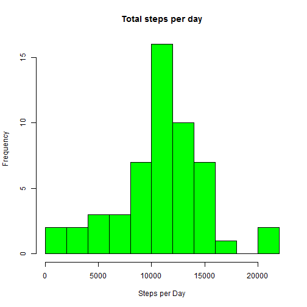
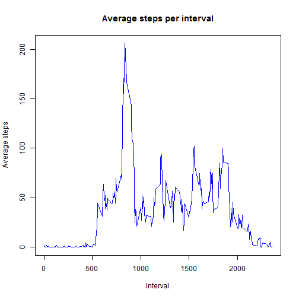
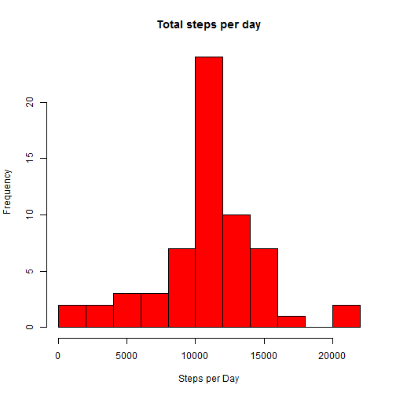
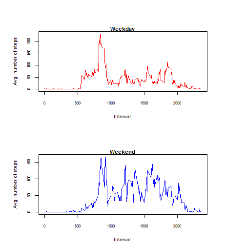

# Reproducible Research - Peer Assessment 1

The source data can be downloaded from [here][1]
[1]: https://d396qusza40orc.cloudfront.net/repdata%2Fdata%2Factivity.zip

The data must be located in the current working directory and the name of the file must be "activity.csv"


```r
library(knitr)
opts_chunk$set(echo = TRUE, results = 'hold')
```

## PART I - Loading and preprocessing the data
* Load the data
* Process/transform the data (if necessary) into a format suitable for your analysis

```r
data1 <- read.csv("activity.csv")
data1$date <- as.Date(data1$date)
```

Check the data using summary() method

```r
summary(data1)
```

```
##      steps             date               interval     
##  Min.   :  0.00   Min.   :2012-10-01   Min.   :   0.0  
##  1st Qu.:  0.00   1st Qu.:2012-10-16   1st Qu.: 588.8  
##  Median :  0.00   Median :2012-10-31   Median :1177.5  
##  Mean   : 37.38   Mean   :2012-10-31   Mean   :1177.5  
##  3rd Qu.: 12.00   3rd Qu.:2012-11-15   3rd Qu.:1766.2  
##  Max.   :806.00   Max.   :2012-11-30   Max.   :2355.0  
##  NA's   :2304
```

## PART II - What is mean total number of steps taken per day?

* Calculate the total number of steps taken per day

```r
data2 <- data1[which(!is.na(data1$steps)),]
agg2 <- aggregate(data2$steps, by = list(data2$date), sum)
colnames(agg2) <- c("day", "steps.per.day")

summary(agg2)
```

```
##       day             steps.per.day  
##  Min.   :2012-10-02   Min.   :   41  
##  1st Qu.:2012-10-16   1st Qu.: 8841  
##  Median :2012-10-29   Median :10765  
##  Mean   :2012-10-30   Mean   :10766  
##  3rd Qu.:2012-11-16   3rd Qu.:13294  
##  Max.   :2012-11-29   Max.   :21194
```

* Make a histogram of the total number of steps taken each day

```r
hist(agg2$steps.per.day, col = "green", breaks = 8, xlab = "Steps per Day", main = "Total steps per day")
```

 

* Calculate and report the mean and median of the total number of steps taken per day

```r
options("scipen"=100, "digits"=4)
mean2 <- mean(agg2$steps.per.day)
median2 <- median(agg2$steps.per.day)
```
The mean is 10766.1887 and the median is 10765

## PART III - What is the average daily activity pattern?

* Make a time series plot of the 5-minute interval (x-axis) and the average number of steps taken, averaged across all days (y-axis)

```r
data3 <- data2
agg3 <- aggregate(data3$steps, by = list(data3$interval), mean)
colnames(agg3) <- c("interval", "steps.per.interval")
plot(agg3$interval, agg3$steps.per.interval, type="l", col="blue", main="Average steps per interval", xlab="Interval", ylab="Average steps")
```

 

* Which 5-minute interval, on average across all the days in the dataset, contains the maximum number of steps?

```r
max3 <- max(agg3$steps.per.interval)
interval3 <- agg3[which(agg3$steps.per.interval == max3), 1]
```
The interval 835th contains the maximum number of steps, that is 206.1698

## PART IV - Imputing missing values

* Calculate and report the total number of missing values in the dataset

```r
total.na <- sum(is.na(data1))
```
The total number of missing values is 2304

* Devise a strategy for filling in all of the missing values in the dataset.

Replace the missing values with the average number of steps taken per interval

* Create a new dataset that is equal to the original dataset but with the missing data filled in.

```r
data4 <- data1
for (i in which(is.na(data4))) {
        data4[i,1] <- agg3[agg3$interval == data4[i,3], 2]
}
summary(data4)
```

```
##      steps            date               interval   
##  Min.   :  0.0   Min.   :2012-10-01   Min.   :   0  
##  1st Qu.:  0.0   1st Qu.:2012-10-16   1st Qu.: 589  
##  Median :  0.0   Median :2012-10-31   Median :1178  
##  Mean   : 37.4   Mean   :2012-10-31   Mean   :1178  
##  3rd Qu.: 27.0   3rd Qu.:2012-11-15   3rd Qu.:1766  
##  Max.   :806.0   Max.   :2012-11-30   Max.   :2355
```

* Make a histogram of the total number of steps taken each day 

```r
agg4 <- aggregate(data4$steps, by = list(data4$date), sum)
colnames(agg4) <- c("day", "steps.per.day")
hist(agg4$steps.per.day, col = "red", breaks = 8, xlab = "Steps per Day", main = "Total steps per day")
```

 

* Calculate and report the mean and median total number of steps taken per day.

```r
mean4 <- mean(agg4$steps.per.day)
median4 <- median(agg4$steps.per.day)
```
The mean is 10766.1887 and the median is 10766.1887

* Do these values differ from the estimates from the first part of the assignment? 

No, these values do not differ from the estimates in PART II. The mean are identical and the small difference in medians can be a consequence of an internal rounding.

* What is the impact of imputing missing data on the estimates of the total daily number of steps?

There is no impact. The estimates are identical.

## PART V - Are there differences in activity patterns between weekdays and weekends?

* Create a new factor variable in the dataset with two levels - "weekday" and "weekend" indicating whether a given date is a weekday or weekend day.

```r
data5 <- data4
data5$day.name <- weekdays(data5$date, abbreviate=TRUE)
data5$day.type <- as.factor(ifelse(tolower(data5$day.name) %in% c("sáb","dom","sat","sun"), "Weekend", "Weekday"))
summary(data5)
```

```
##      steps            date               interval      day.name        
##  Min.   :  0.0   Min.   :2012-10-01   Min.   :   0   Length:17568      
##  1st Qu.:  0.0   1st Qu.:2012-10-16   1st Qu.: 589   Class :character  
##  Median :  0.0   Median :2012-10-31   Median :1178   Mode  :character  
##  Mean   : 37.4   Mean   :2012-10-31   Mean   :1178                     
##  3rd Qu.: 27.0   3rd Qu.:2012-11-15   3rd Qu.:1766                     
##  Max.   :806.0   Max.   :2012-11-30   Max.   :2355                     
##     day.type    
##  Weekday:12960  
##  Weekend: 4608  
##                 
##                 
##                 
## 
```

* Make a panel plot containing a time series plot (i.e. type = "l") of the 5-minute interval (x-axis) and the average number of steps taken, averaged across all weekday days or weekend days (y-axis).

```r
data5.Weekday <- data5[data5$day.type == "Weekday",]
data5.Weekend <- data5[data5$day.type == "Weekend",]

agg5.Weekday <- aggregate(data5.Weekday$steps, by = list(data5.Weekday$interval), mean)
colnames(agg5.Weekday) <- c("interval", "steps.per.interval")
agg5.Weekend <- aggregate(data5.Weekend$steps, by = list(data5.Weekend$interval), mean)
colnames(agg5.Weekend) <- c("interval", "steps.per.interval")

par(cex.axis=.65, cex.lab=.85, cex.main=.95)
par(mar=c(1,4,1,2))
par(pin=c(4.8,1.7))
par(mfrow=c(2,1))
plot(agg5.Weekday$interval, agg5.Weekday$steps.per.interval, type="l", col="red", main="Weekday", xlab="Interval", ylab="Avg. number of steps")
plot(agg5.Weekend$interval, agg5.Weekend$steps.per.interval, type="l", col="blue", main="Weekend", xlab="Interval", ylab="Avg. number of steps")
```

 

Based on the above graphics, we can conclude that
* weekday plot has the greatest peak from all steps intervals. 
* the weekend presents more peaks than weekday. 
* there is a better distribution in weekend than weekday.

